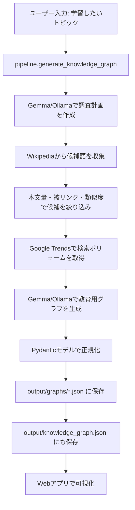
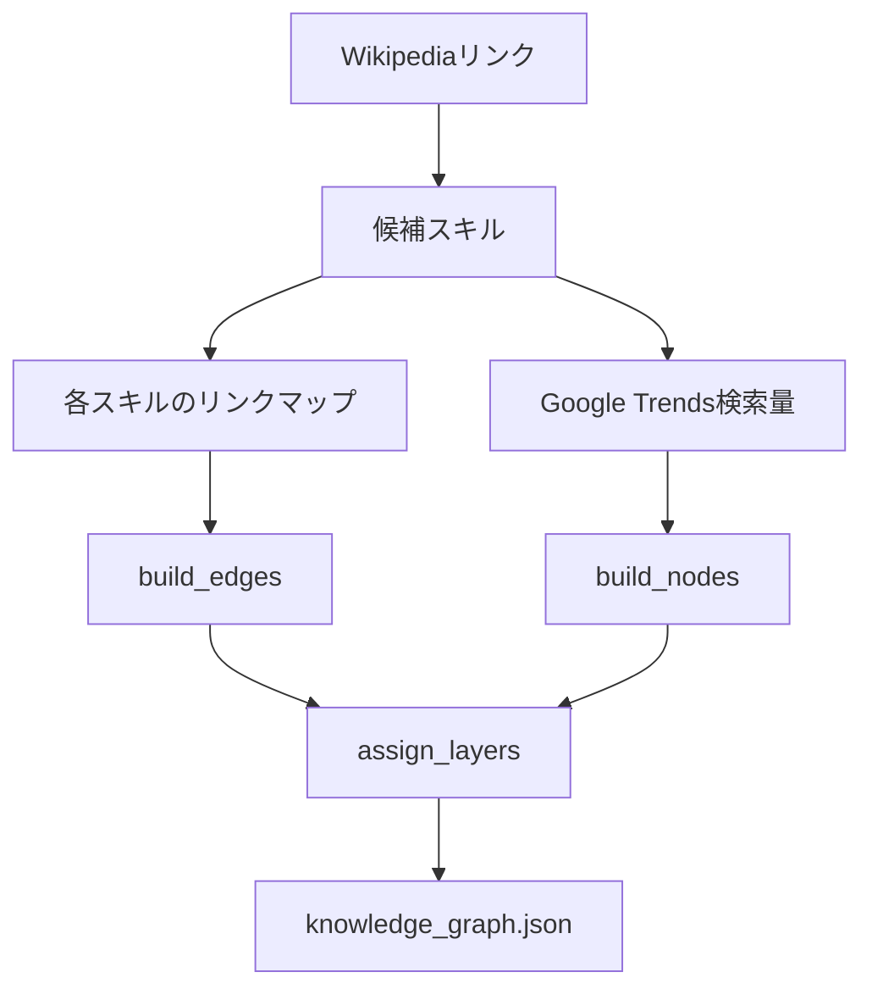

# Knowledge Graph Collector 技術書

## はじめに

このシステムは、入力された学習トピックからナレッジグラフを自動生成し、ブラウザで可視化するための Python アプリケーションです。

初期フェーズでは Wikipedia のリンク構造と Google Trends の検索ボリュームだけを使う「AIなし」の構成でした。現在のコードベースには、その非AIグラフ生成ロジックに加えて、ローカル Ollama/Gemma 系モデルを使って教育的な学習ロードマップへ整形するパイプラインも含まれています。

このため、現在のシステムは大きく次の2層で理解するとわかりやすいです。

1. 非AIデータ収集層  
   Wikipedia API と Google Trends から候補語、リンク、検索量を取得する。

2. 教育設計・可視化層  
   取得した候補から学習用ノード・依存エッジを構築し、JSON保存とWeb可視化を行う。現在の主パイプラインでは Ollama/Gemma による教育設計も利用する。

## 全体構成

```text
in_collecter/
  src/
    collector/
      main.py                  # CLIエントリーポイント
      pipeline.py              # 現在の主パイプライン
      wikipedia_collector.py   # Wikipedia / MediaWiki API 取得・類似度・候補抽出
      trends_collector.py      # Google Trends 検索ボリューム取得
      graph_builder.py         # 非AIグラフ生成・レイヤー計算・JSON保存
      gemma_graph_builder.py   # Ollama/Gemmaで学習グラフを生成
      ollama_agent.py          # Ollama補助、改善、クイズ評価
      keyword_filter.py        # キーワードによるWikipedia候補フィルタ
      web_app.py               # ブラウザ可視化アプリ
    models/
      graph_models.py          # Pydanticモデル
  tests/
    test_wikipedia_collector.py
    test_graph_builder.py
  output/
    knowledge_graph.json       # 最新または互換用の出力
    graphs/                    # タイムスタンプ付き生成結果
  requirements.txt
```

## 実行モード

### CLI生成

```bash
cd /Users/kawakamiyasumasa/Documents/in_collecter
myenv/bin/python src/collector/main.py "機械学習"
```

`main.py` は薄い入口で、実体は `pipeline.generate_knowledge_graph()` に委譲します。

### Webアプリ起動

```bash
cd /Users/kawakamiyasumasa/Documents/in_collecter
myenv/bin/python src/collector/web_app.py
```

起動後に次のURLを開きます。

```text
http://127.0.0.1:8000
```

停止はサーバーを起動しているターミナルで `Ctrl + C` です。

### テスト

```bash
cd /Users/kawakamiyasumasa/Documents/in_collecter
myenv/bin/python -m unittest discover -s tests -v
```

## データフロー

現在の主フローは以下です。



非AIの基本グラフ生成は `graph_builder.py` に残っています。



## 主要モジュール

### `src/collector/main.py`

CLI入口です。直接大きな処理は持たず、`pipeline.py` の `generate_knowledge_graph()` と `main()` を再エクスポートしています。

役割:

- コマンドライン実行を受ける
- パッケージ実行と直接実行の両方に対応する
- 実処理を `pipeline.py` に委譲する

### `src/collector/pipeline.py`

現在の中核です。トピック入力からグラフ保存までの全体制御を担当します。

主な処理:

- Ollama/Gemmaで調査計画を作成
- 調査計画の `seed_terms` をもとにWikipedia候補を広く収集
- Google Trendsで候補語の検索量を取得
- Gemmaに教育用ナレッジグラフをJSONで生成させる
- ノード数が25を超えた場合は再度絞り込みを要求
- `output/graphs/{topic}_{timestamp}.json` に保存
- 互換用として `output/knowledge_graph.json` にも保存

保存ファイル名は `_sanitize_filename()` で安全な文字列に変換されます。

### `src/collector/wikipedia_collector.py`

Wikipedia取得と候補抽出の中心です。初期実装では `wikipedia-api` を使っていましたが、現在は `requests` による MediaWiki API クライアント `_MediaWikiClient` が中心です。

主な機能:

- `_MediaWikiClient`
  - `https://ja.wikipedia.org/w/api.php` にアクセス
  - `links` と `extracts` を取得
  - 429を検知した場合に待機して再試行
  - ページキャッシュを保持

- `get_all_links(topic)`
  - トピックページの全リンクと本文を返す

- `get_related_skills(topic)`
  - トピックページのリンク先のうち、存在するページを候補として返す

- `get_link_map(skills)`
  - 各候補ページが持つリンクを辞書で返す

- `filter_skills(...)`
  - 本文量
  - 被リンク数
  - トピック本文とのTF-IDF類似度
  - 地名・大学などの除外キーワード
  で候補を絞り込む

- `get_important_skills(topic)`
  - 広くリンクを集めた後、学習候補らしいものだけに絞る

- `get_semantic_enrichment(topic, skills)`
  - ページタイプ、本文類似度、関連度ラベル、説明文などを付与する

### `src/collector/trends_collector.py`

Google Trendsから検索ボリュームを取得します。

主な仕様:

- `pytrends` の `TrendReq` を使用
- 5件ずつまとめて取得
- 1チャンクごとに `sleep(1)`
- 失敗時は最大3回リトライ
- 取得できない語は `0` として扱う
- 過去12か月、地域JPの平均値を整数化

検索ボリュームは、非AIグラフ生成では `difficulty_score` の正規化元として使われます。現在のGemma主パイプラインでは互換性のため取得していますが、最終グラフ構成はGemma出力が主になります。

### `src/collector/graph_builder.py`

初期フェーズの非AIグラフ生成ロジックです。

主な関数:

- `build_nodes(skills, search_volumes, semantic_enrichment=None)`
  - スキル名をノードに変換
  - 検索ボリュームを0から1に正規化
  - `mastery` は `0.0`
  - semantic情報があれば説明やページタイプも付与

- `build_edges(skills, link_map, semantic_enrichment=None)`
  - Wikipediaリンクからエッジを作る
  - AページがBにリンクしている場合、BをAの前提知識として扱う
  - 出力方向は `from: prerequisite`, `to: later_skill`

- `assign_layers(nodes, edges)`
  - NetworkXの有向グラフを作成
  - 循環依存がある場合、循環エッジを削除
  - トポロジカル順序で layer を計算

- `save_graph(nodes, edges, topic)`
  - `output/knowledge_graph.json` に保存

### `src/collector/gemma_graph_builder.py`

Ollamaのローカルモデル、標準では `gemma4:latest` を使って教育用ナレッジグラフを生成するモジュールです。

主な特徴:

- `/api/generate` をストリーミングで呼び出す
- LLM出力からJSONのみを抽出
- JSON解析に失敗した場合、最大3回再試行
- ノードIDを英数字とアンダースコアへ正規化
- layerを0から3に制限
- difficultyやweightを0から1にクランプ
- Pydanticモデル `KnowledgeGraph`, `KnowledgeNode`, `KnowledgeEdge` に変換

LLMに与えるプロンプトでは、次の教育設計ルールを強制しています。

- ノード数は15から25
- 学習して習得できる概念・スキルのみ
- layer 0: 前提知識
- layer 1: 基礎概念
- layer 2: 中核概念
- layer 3: 応用・発展
- エッジは教育的な依存関係のみ

### `src/collector/ollama_agent.py`

補助的なOllama利用モジュールです。現在の主パイプラインでは `gemma_graph_builder.py` が中心ですが、このファイルにはグラフ改善や理解度テストの機能が入っています。

主な機能:

- 既存グラフを見て追加検索語を提案
- Wikipediaで追加候補を検索
- 学習ロードマップ用の前提ノードを追加
- 不要そうな人物・年代系ノードを削除
- 理解度クイズを作成
- 回答をキーワード一致で採点
- 弱点ノードの `difficulty_score` を上げる

### `src/models/graph_models.py`

Pydanticによるグラフ構造の型定義です。

`KnowledgeNode`:

- `node_id`
- `label`
- `type`
- `layer`
- `description`
- `prerequisites`
- `mastery`
- `hesitation_score`
- `cognitive_load_history`
- `next_review`
- `review_count`
- `difficulty_score`
- `semantic`

`KnowledgeEdge`:

- `edge_id`
- `source_id`
- `target_id`
- `relationship`
- `weight`
- `description`
- `semantic`

`KnowledgeGraph`:

- `graph_id`
- `topic`
- `created_at`
- `updated_at`
- `nodes`
- `edges`
- `meta`

## Webアプリ

`src/collector/web_app.py` は標準ライブラリの `http.server` を使った軽量Webアプリです。

### 画面機能

- トピック入力
- 生成ボタン
- 既存JSONファイル選択
- ノード検索
- Fitボタン
- Reloadボタン
- Canvasによるグラフ描画
- ノードクリック時の詳細表示
- LLM Discussion表示
- LLM Live Output表示
- Quiz Evaluation表示
- Research Plan表示
- Layer別一覧表示

### API

`GET /`

- HTMLを返す

`GET /graph-files`

- `output/graphs/*.json` と `output/knowledge_graph.json` の一覧を返す

`GET /graph.json`

- 最新グラフまたは指定ファイルを返す
- `?file=output/graphs/xxx.json` でファイル指定可能
- 安全のため、プロジェクト外の絶対パスは拒否する

`POST /generate`

リクエスト:

```json
{
  "topic": "機械学習"
}
```

レスポンス:

```json
{
  "graph": {
    "topic": "機械学習",
    "nodes": [],
    "edges": [],
    "refinement": []
  },
  "summary": {
    "node_count": 20,
    "edge_count": 30
  },
  "research_plan": {},
  "output_path": "output/graphs/機械学習_20260724_001234.json"
}
```

## JSON形式

現在の主出力はGemma/Pydantic系の形式です。

```json
{
  "graph_id": "uuid",
  "topic": "機械学習",
  "created_at": "2026-07-24T00:00:00Z",
  "updated_at": "2026-07-24T00:00:00Z",
  "nodes": [
    {
      "node_id": "N1",
      "label": "線形代数",
      "type": "FOUNDATIONAL",
      "layer": 0,
      "description": "ベクトルや行列を扱う数学基礎",
      "prerequisites": [],
      "mastery": 0.0,
      "hesitation_score": 0.0,
      "cognitive_load_history": [],
      "next_review": "2026-07-24",
      "review_count": 0
    }
  ],
  "edges": [
    {
      "edge_id": "N1__N2",
      "source_id": "N1",
      "target_id": "N2",
      "relationship": "prerequisite",
      "weight": 0.9,
      "description": "線形代数は機械学習モデル理解の前提"
    }
  ],
  "meta": {
    "total_skills": 20,
    "layer_0": 5,
    "layer_1": 5,
    "layer_2": 6,
    "layer_3": 4
  }
}
```

非AI `graph_builder.py` 系では、エッジは `from` / `to` 形式です。Webアプリは両方の形式に対応しています。

## レイヤーの意味

現在の教育設計モードでは layer は0から3に制限されます。

| layer | 意味 |
|---:|---|
| 0 | 前提知識 |
| 1 | 基礎概念 |
| 2 | 中核概念 |
| 3 | 応用・発展 |

初期の非AIモードでは、トポロジカルソートにより layer が0以上の任意の整数になり得ます。

## エラー処理

### Wikipedia

- HTTP 429 の場合は `Retry-After` または段階的待機で再試行
- 取得失敗ページは空ページとして扱う
- 存在しないページは警告を出してスキップ
- 5ページごとに短いsleepを入れる

### Google Trends

- 5件ずつ取得
- 最大3回リトライ
- 失敗した語は検索ボリューム0
- rate limitに備えてチャンクごとにsleep

### LLM / Ollama

- 接続できない場合は空応答
- JSON解析に失敗したら再プロンプト
- 最大3回試行
- それでも失敗したらパイプラインは空グラフとエラーを返す

### Web

- 不正なAPIは404
- topicなしの生成は400
- クライアント切断時は警告を出してレスポンス送信を中止
- ファイル指定はプロジェクト配下に限定

## テスト設計

テストは `unittest` ベースです。

`tests/test_wikipedia_collector.py`:

- Wikipedia APIへの実リクエストを発生させない
- `_create_wiki` をモックする
- 存在ページ、欠落ページ、namespaceリンク除外を検証
- TF-IDF類似度、ページ分類、重要候補抽出も検証
- Ollama補助関数の一部もモックで検証

`tests/test_graph_builder.py`:

- 検索量正規化
- `mastery` と `layer` の初期値
- Wikipediaリンク方向の反転
- スキルリスト外エッジの除外
- 自己リンクと重複の除外
- layer計算
- 循環依存への耐性

## 注意点

### 「AIなし」要件との関係

初期要件は「LLMを一切使わない」フェーズ1でした。この要件に該当するコードは主に次です。

- `wikipedia_collector.py`
- `trends_collector.py`
- `graph_builder.py`

ただし現在の `main.py` は `pipeline.py` に委譲しており、`pipeline.py` は `gemma_graph_builder.py` を使います。つまり現在のCLI主経路はLLM補助ありです。

純粋なAIなしモードを正式な実行経路として残すなら、次のように分けるのがよいです。

- `main_no_ai.py`
  - Wikipedia + Trends + graph_builder のみ

- `main.py`
  - 現在の教育設計LLMパイプライン

この分離をすると、フェーズ1の検証とフェーズ2以降のLLM拡張が混ざらず、保守しやすくなります。

### 現在の候補抽出の癖

Wikipediaリンクはページ構造に強く依存します。たとえば「日本」や「Python」のような広いページでは、年号、日付、識別子、イベント、組織が多く混ざります。

その対策として現在は以下が入っています。

- 除外キーワード
- 本文量しきい値
- 被リンク数しきい値
- TF-IDF類似度
- Gemmaによる教育的な再選別

それでも完全ではないため、今後は「学習概念らしさ」のスコアリングを別モジュール化するとよいです。

## 拡張ロードマップ

### 1. 非AIモードの明示化

`main_no_ai.py` を追加し、LLMなしで必ず動く入口を用意します。

### 2. 設定ファイル化

現在は件数上限、sleep秒数、モデル名などがコード内にあります。`config.toml` または `.env` に移すと運用しやすくなります。

### 3. グラフ形式の統一

現在は非AI形式の `from/to` と、Pydantic形式の `source_id/target_id` が混在しています。内部形式を `source_id/target_id` に統一し、保存時だけ互換変換すると安全です。

### 4. 非同期ジョブ化

`POST /generate` は同期処理です。Wikipedia、Trends、Ollamaで時間がかかるため、WebではジョブIDを返して進捗ポーリングする設計が望ましいです。

### 5. UIの強化

- layerごとの横方向レイアウト改善
- ノードのドラッグ移動
- エッジの重みに応じた太さ変更
- JSONエクスポートボタン
- PNG保存
- ノード詳細の編集

### 6. 学習状態の永続化

`mastery`, `hesitation_score`, `next_review`, `review_count` はすでにモデルに存在します。次の段階では、ユーザーの学習結果を保存して復習スケジュールに使えます。

## 開発者向けクイックリファレンス

依存インストール:

```bash
cd /Users/kawakamiyasumasa/Documents/in_collecter
myenv/bin/pip install -r requirements.txt
```

Web起動:

```bash
myenv/bin/python src/collector/web_app.py
```

CLI生成:

```bash
myenv/bin/python src/collector/main.py "Pythonでデータ分析を学びたい"
```

テスト:

```bash
myenv/bin/python -m unittest discover -s tests -v
```

最新JSON確認:

```bash
myenv/bin/python -m json.tool output/knowledge_graph.json
```

## まとめ

このシステムは、Wikipediaを知識候補の入口、Google Trendsを難易度の補助信号、NetworkX/Pydanticをグラフ構造の基盤、Ollama/Gemmaを教育設計の補助として使うナレッジグラフ生成アプリです。

設計のポイントは、外部情報取得、候補フィルタ、教育的グラフ構築、保存、可視化がモジュールごとに分かれている点です。今後は「AIなしモード」と「LLM補助モード」を入口レベルで明確に分けることで、フェーズ1の再現性と高度な教育設計の両方を扱いやすくできます。
